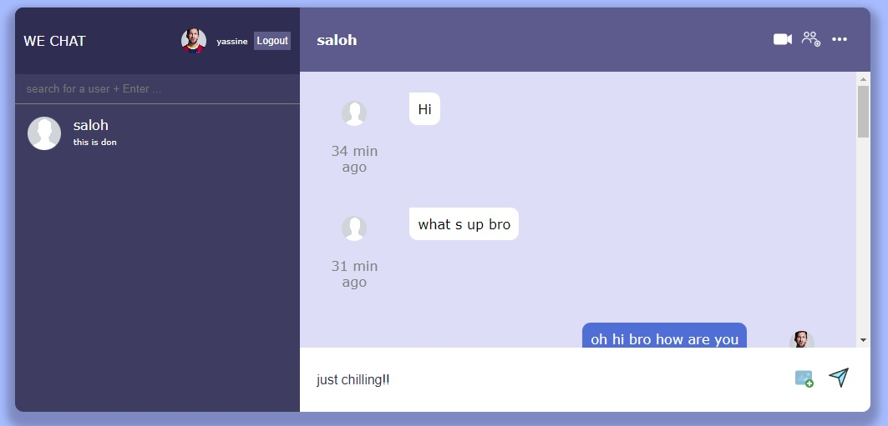
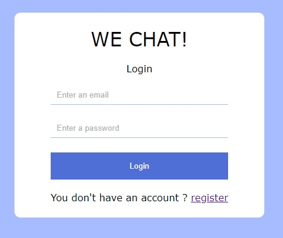
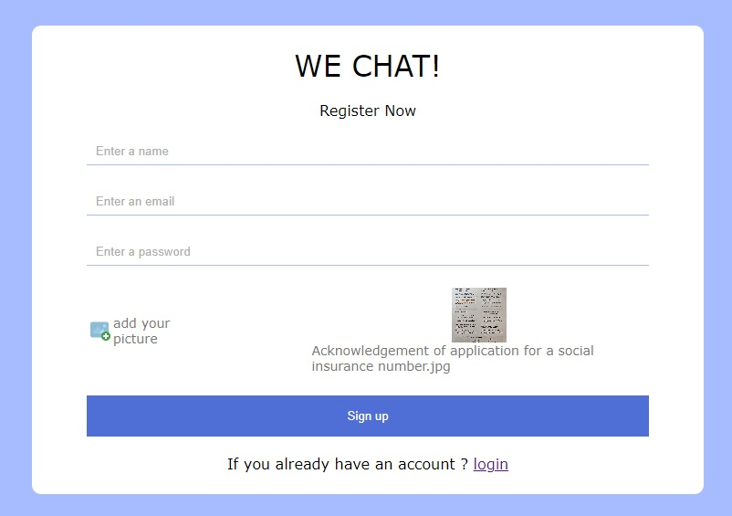
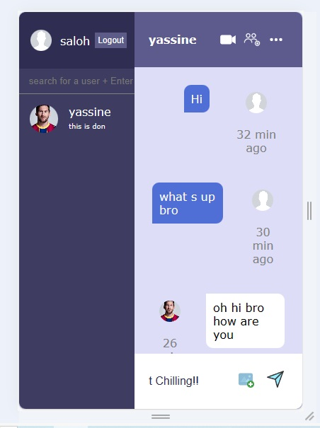
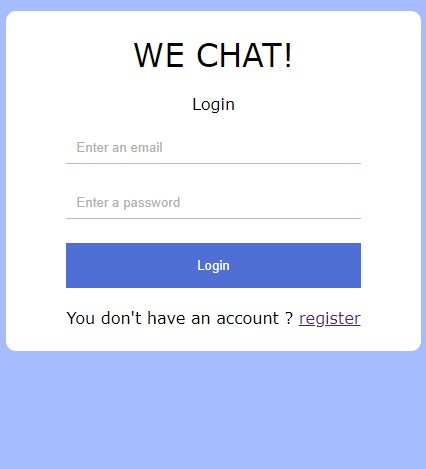
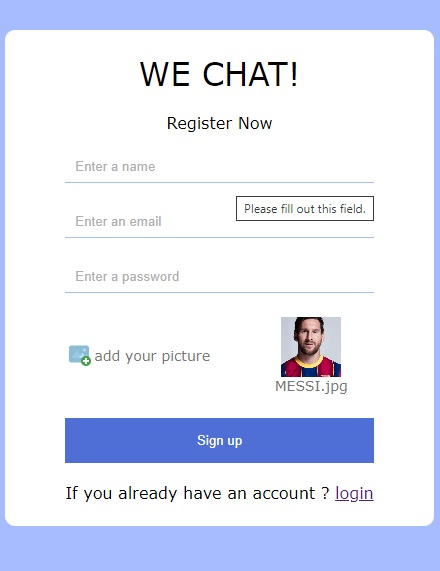

# WeChat - A Chatting App using React, Firebase, and SCSS

Welcome to WeChat! WeChat is a real-time messaging application built with React, Firebase, and SCSS, designed to facilitate seamless communication between users. Whether you want to chat with friends, family, or colleagues, WeChat provides a modern and intuitive platform to connect with others instantly.

## Screenshots
- **Desktop**

App view

Login view

Regiser view
- **Mobile**

App view

Login view

Regiser view

## Features

- **Real-time Messaging**: Experience instant messaging with real-time updates, ensuring smooth and seamless conversations.
- **User Authentication**: Securely sign in with Firebase Authentication, ensuring your conversations remain private and safe.
- **User Profiles**: Customize your profile with display names, avatars, and status messages to personalize your WeChat experience.
- **Responsive Design**: WeChat is designed to work seamlessly across various devices, ensuring a consistent and enjoyable user experience on desktop, tablet, and mobile.
- **Customizable Themes**: Customize the app's look and feel with SCSS, allowing you to create your unique style.

